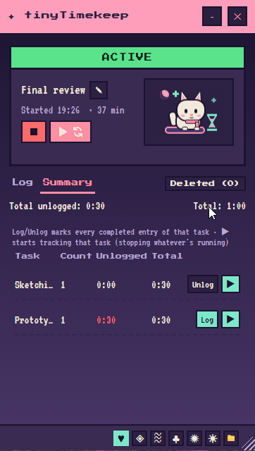
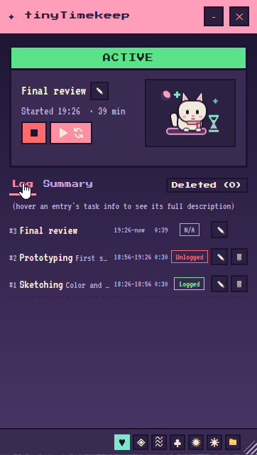
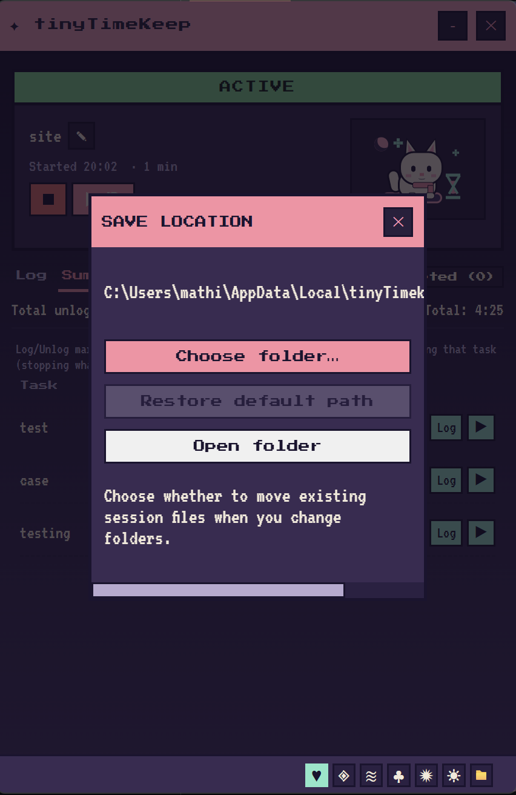
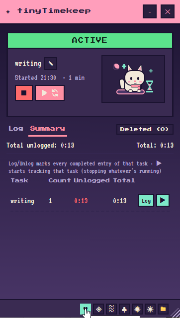
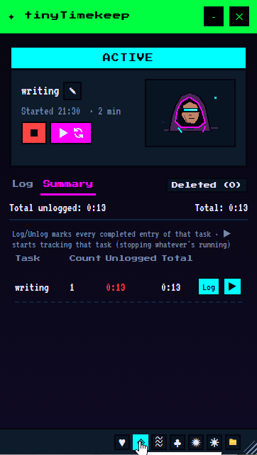
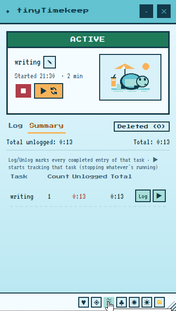
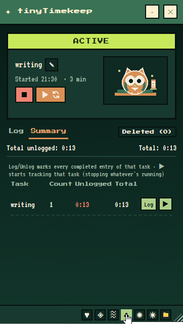
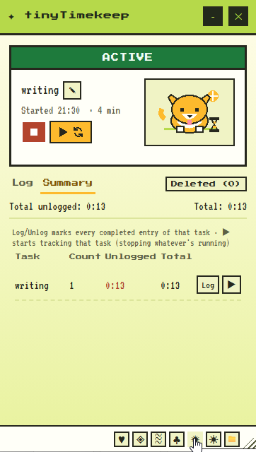
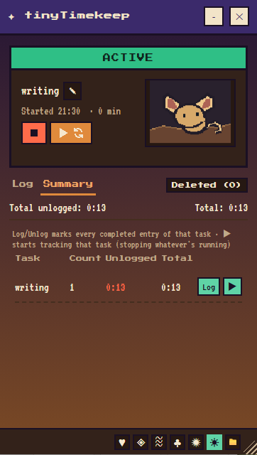

# tinyTimekeep

tinyTimekeep is a small Windows desktop app for tracking time in sessions. Start a
session, switch between tasks as you work, then review your entries and totals.

## Screenshots







## Themes

The active tracking screen in all six supported themes:

<p>
<span><a href="docs/screenshots/themes/cute.png"></a></span><span><a href="docs/screenshots/themes/cyber.png"></a></span><span><a href="docs/screenshots/themes/poolside.png"></a></span><br>
<span><a href="docs/screenshots/themes/evergreen.png"></a></span><span><a href="docs/screenshots/themes/citrus-pop.png"></a></span><span><a href="docs/screenshots/themes/dune.png"></a></span>
</p>

## Download and run

1. Open the [tinyTimekeep releases page](https://github.com/sweatyeti/tiny-timekeep/releases).
2. Open the newest release and download the executable shown under its **Assets**
   section. Releases currently contain pre-release builds; there is no stable v1.0
   release yet.
   Releases through `v1.0-beta3` use `KeeperOfTime.exe`.
   Future releases built from the updated packaging will use `tinyTimekeep.exe`.
3. Run the downloaded file. There is no installer.

The published app is for Windows and requires the Microsoft Edge WebView2 Runtime,
which is normally included with Windows 10 and 11. The executable is unsigned, so
Windows may show a SmartScreen warning. Download it only from the project's releases
page.

The app loads its pixel fonts from Google Fonts, so an internet connection may be
needed for the fonts to appear as intended.

## Track your time

1. Choose **Start new session**. A session name and first task are optional. To continue
   an earlier session, select it from the resume list instead.
2. Use the play button in the tracking panel to start a task or switch to another one.
   You can give a task an optional description. Use the stop button to stop tracking;
   closing the window also stops tracking and exits the app.
3. Open **Log** to review and edit entries. Open **Summary** to see time totals by
   task. In Summary, **Log** and **Unlog** mark all completed entries for a task, and
   the play button starts tracking that task.

## Session files and save location

By default, session files are stored on this PC in:

`%LOCALAPPDATA%\KeeperOfTime\sessions`

On most Windows PCs, `%LOCALAPPDATA%` points to a folder under your Windows user
account, typically `C:\Users\<your-name>\AppData\Local`.

Use the folder button in the app's bottom toolbar to see or open the current folder,
choose a different folder, or restore the default path. Your choice is remembered for
future launches. When changing folders, the app asks whether to move existing session
files. If you choose to move them, existing session files go to the selected folder. If
you decline, the active session is still moved there so tracking can continue, while
other existing session files remain in the old folder. New sessions are saved in the
selected folder.

## Troubleshooting

- If the app does not open, check that the WebView2 Runtime is installed.
- If the app's pixel fonts do not load, check your internet connection. The interface
  may still open with fallback fonts.
- If Windows displays a SmartScreen warning, remember that the current executable is
  unsigned and verify that you downloaded it from the official releases page.

## For contributors

The Windows build targets Python 3.14.7. From the repository root, create an
environment, install the app and development dependencies, then run the checks:

```powershell
py -3.14 -m venv .venv
.venv\Scripts\python -m pip install -r requirements-dev.txt
.venv\Scripts\python main.py --check
.venv\Scripts\python -m unittest discover -s tests
```

To run from source on Windows, use `.venv\Scripts\python main.py`. The Windows
executable is built with `packaging\build.ps1`.
